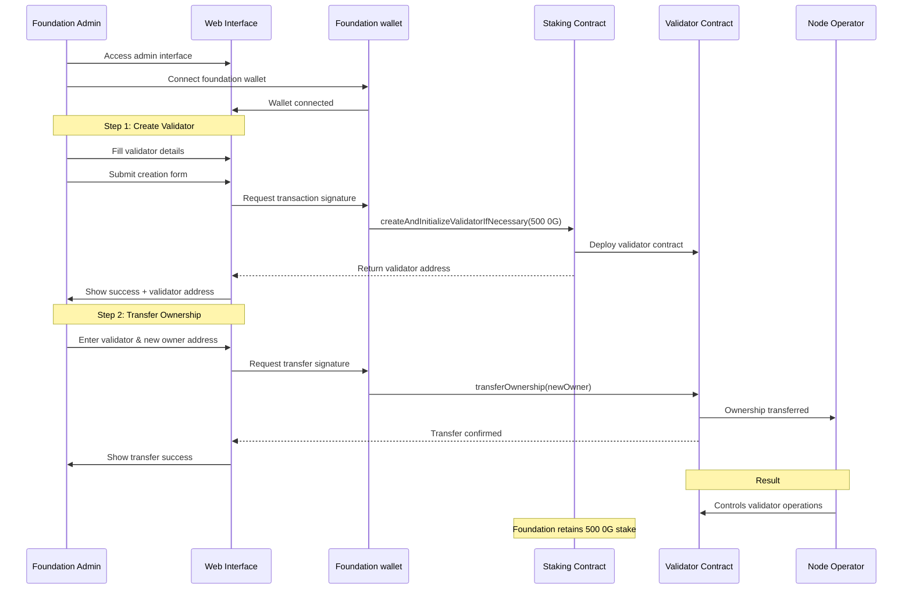
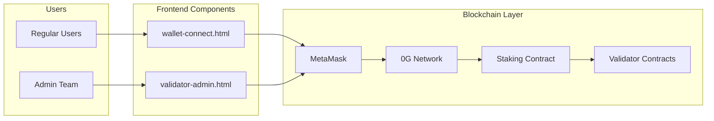
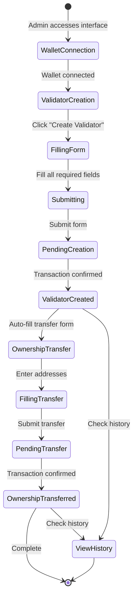

# 0G Validator Delegation System

A comprehensive web-based solution for managing validator initialization and ownership transfer on the 0G Network, designed to enable foundation-controlled validator creation with delegated ownership.

## 🎯 Project Overview

This project provides two main interfaces:
1. **Wallet Connection Interface** - For users to connect their Web3 wallets to the 0G Network
2. **Validator Administration Interface** - For foundation team to create validators and transfer ownership

### Key Features

- 🔐 **Foundation-Controlled Initialization**: Foundation wallet initializes validators with minimum stake
- 🔄 **Ownership Transfer**: Seamless transfer of validator control to node operators
- 💰 **Stake Retention**: Foundation retains control of initial 32 OG stake after ownership transfer
- 📊 **Transaction Tracking**: Complete history of validator creation and ownership transfers
- 🌐 **Multi-Network Support**: Configured for both testnet and mainnet deployments

## 🏗️ System Architecture

### Validator Creation Workflow



### Ownership Model

```mermaid
graph TB
    subgraph "Initial State"
        F1[Foundation Wallet]
        F1 -->|Owns| V1[Validator Contract]
        F1 -->|Controls| S1[32 OG Stake]
    end
    
    subgraph "After Transfer"
        F2[Foundation Wallet]
        NO[Node Operator]
        V2[Validator Contract]
        S2[32 OG Stake]
        
        NO -->|Owns| V2
        F2 -->|Controls| S2
        NO -->|Operates| V2
        NO -.->|Cannot Withdraw| S2
    end
    
    Initial State -->|transferOwnership| After Transfer
```

### Component Interaction



## 📁 Project Structure

```
0g-validator-delegation/
├── wallet-connect.html      # User wallet connection interface
├── validator-admin.html     # Admin validator management interface
└── README.md                # Project documentation
```

## 🚀 Getting Started

### Prerequisites

- Modern web browser with Web3 wallet extension (MetaMask recommended)
- Access to 0G Network (Testnet or Mainnet)
- Foundation wallet with sufficient OG tokens (minimum 32 OG per validator)

### Network Configuration

#### Testnet (Galileo)
- **Network Name**: 0G-Galileo-Testnet
- **Chain ID**: 16601 (0x40d9)
- **RPC URL**: https://evmrpc-testnet.0g.ai
- **Explorer**: https://chainscan-galileo.0g.ai
- **Currency**: OG
- **Staking Contract**: `0xea224dBB52F57752044c0C86aD50930091F561B9`
- **Faucet**: https://faucet.0g.ai

### Installation

1. Clone the repository:
```bash
git clone https://github.com/yourusername/0g-validator-delegation.git
cd 0g-validator-delegation
```

2. Serve the HTML files using any web server:
```bash
# Using Python
python -m http.server 8080

# Using Node.js
npx http-server -p 8080

# Or simply open the HTML files in your browser
```

3. Access the interfaces:
   - User Interface: http://localhost:8080/wallet-connect.html
   - Admin Interface: http://localhost:8080/validator-admin.html

## 💼 Usage Guide

### For Regular Users (wallet-connect.html)

1. **Connect Wallet**
   - Click "Connect Wallet" button
   - Approve connection in MetaMask
   - Network will automatically switch to 0G Galileo Testnet

2. **View Information**
   - Connected wallet address
   - Current network and chain ID
   - OG token balance

### For Foundation Admins (validator-admin.html)

#### Creating a Validator

1. **Connect Foundation Wallet**
   - Click "Connect Foundation Wallet"
   - Ensure you're using the foundation wallet with sufficient OG tokens

2. **Fill Validator Information**
   ```
   Moniker: MyValidator
   Identity: (Optional Keybase ID)
   Website: https://example.com
   Security Contact: security@example.com
   Details: Professional validator service
   ```

3. **Set Commission & Fees**
   ```
   Commission Rate: 10%
   Withdrawal Fee: 1000000 Gwei
   ```

4. **Add Validator Keys**
   ```
   Public Key: 0x... (Validator's public key)
   Signature: 0x... (Validator's signature)
   ```

5. **Specify Future Owner**
   ```
   Future Owner Address: 0x... (Node operator's address)
   ```

6. **Initialize Validator**
   - Click "Initialize Validator"
   - Confirm transaction (32 OG will be staked)
   - Note the validator contract address

#### Transferring Ownership

1. **Navigate to Transfer Tab**
   - Click "Transfer Ownership" tab

2. **Enter Addresses**
   ```
   Validator Contract: 0x... (From creation step)
   New Owner: 0x... (Node operator's address)
   ```

3. **Execute Transfer**
   - Click "Transfer Ownership"
   - Confirm transaction
   - Ownership is transferred while foundation retains the 32 OG stake

#### Viewing Transaction History

- Click "Transaction History" tab
- View all validator creations and ownership transfers
- Click transaction hashes to view on block explorer

## 🔑 Key Concepts

### Validator Initialization
- Requires minimum 32 OG tokens stake
- Creates a new validator contract
- Sets initial parameters (commission, fees, etc.)
- Foundation wallet becomes initial owner

### Ownership Transfer
- Transfers control of validator operations to node operator
- Foundation retains the initial 32 OG stake
- Node operator cannot withdraw foundation's stake
- Only the initial staker can withdraw the initial stake

### Security Considerations
- Foundation wallet should be a secure multi-sig wallet
- Validate all addresses before transactions
- Keep transaction records for audit purposes
- Regular monitoring of validator status

## 📊 Transaction Flow



## 🛠️ Technical Implementation

### Smart Contract Interactions

#### Create Validator
```javascript
stakingContract.methods.createAndInitializeValidatorIfNecessary(
    description,      // {moniker, identity, website, securityContact, details}
    commissionRate,   // in basis points (10% = 1000)
    withdrawalFee,    // in Gwei
    pubkey,          // validator public key
    signature        // validator signature
).send({
    from: foundationWallet,
    value: web3.utils.toWei('32', 'ether')
});
```

#### Transfer Ownership
```javascript
validatorContract.methods.transferOwnership(
    newOwnerAddress  // node operator address
).send({
    from: foundationWallet
});
```

### Data Persistence
- Transaction history stored in browser's localStorage
- Key: `0g_transactions`
- Format: JSON array of transaction objects

## 🐛 Troubleshooting

### Common Issues

1. **"Please install MetaMask"**
   - Install MetaMask extension from https://metamask.io

2. **"Wrong Network"**
   - Allow the interface to add and switch to 0G Network
   - Or manually add network with provided configuration

3. **"Insufficient Balance"**
   - Ensure foundation wallet has at least 32 OG + gas fees
   - Use faucet for testnet: https://faucet.0g.ai

4. **Transaction Failed**
   - Check gas settings
   - Verify all input parameters
   - Ensure correct wallet is connected

## 📝 Configuration Updates

### For Mainnet Deployment

Update the configuration in `validator-admin.html`:

```javascript
mainnet: {
    chainId: '0x....',           // Update with actual mainnet chain ID
    chainName: '0G Mainnet',
    stakingContract: '0x....',   // Update with mainnet staking contract
    rpcUrl: 'https://...',       // Update with mainnet RPC
    explorer: 'https://...',     // Update with mainnet explorer
    currency: 'OG'
}
```

## 🔗 Important Links

- **0G Documentation**: https://docs.0g.ai
- **Testnet Faucet**: https://faucet.0g.ai
- **Block Explorer (Galileo)**: https://chainscan-galileo.0g.ai
- **Storage Explorer**: https://storagescan-galileo.0g.ai
- **Validator Dashboard**: https://testnet.0g.explorers.guru

## 📄 License

This project is designed for the 0G Network validator management system.

## 🤝 Support

For issues or questions:
- Technical documentation: https://docs.0g.ai/developer-hub
- Network status: Check block explorer
- Validator support: Contact 0G team

---

**Note**: This system is designed for controlled validator initialization where the foundation maintains stake ownership while delegating operational control to node operators. Always verify addresses and test on testnet before mainnet deployment.